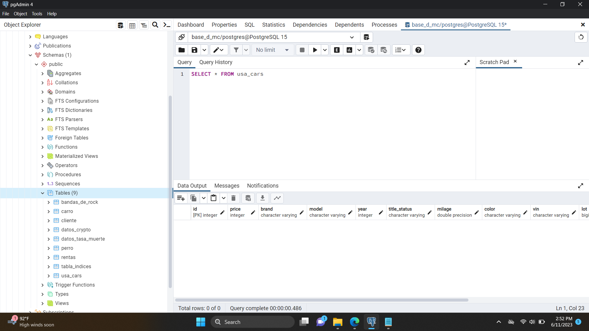
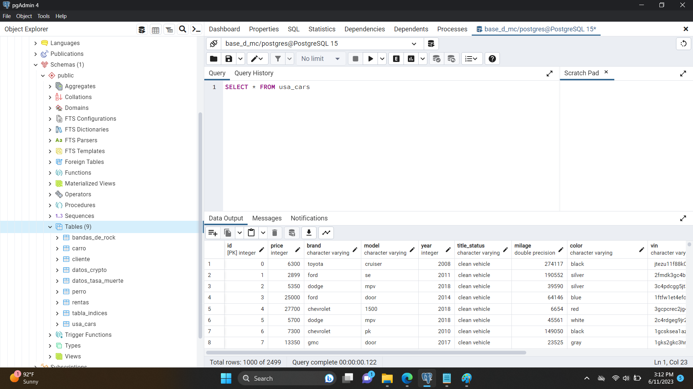
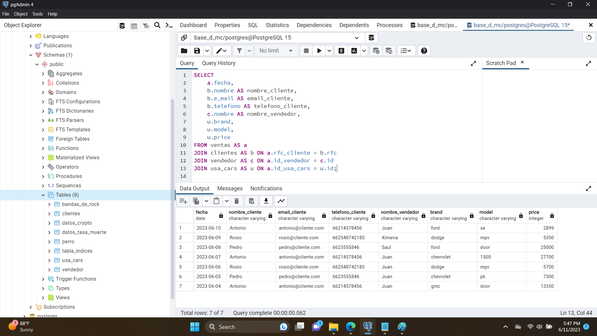

# Proyecto uso de SQL en bases de datos
### Julian Villaseñor Ibarra
### Maestria en Ciencia de datos

En este trabajo vamos a usar un data set de kaggle llamado 'US Cars' que usaremos para hacer consultas, usare postgres para hacer las querys,
lo primero que necesitamos en postgres es crear una base de datos, esto se hace con un "CREATE DATABASE ejercicio", igual la podemos eliminar don un
"DROP DATABASE ejercicio", ya que tenemos nuestra base de datos podemos comenzar a crear nuestras tablas, como para el ejercicio empezare usando un
data set de kaggle primero creare una tabla para poner todos los datos ahi, es importante que las columnas que se creen para la tabla puedan almacenar
los datos que se encuentra en el csv, es decir si los datos son flotantes, la columna tiene que ser de tipo float, si son string tiene que ser de tipo varchar()
, si son fechas se recomienda el formato DATE para poder realizar un order by luego a esa columna, identificar la columna identidad del dataset, para asignarle
la primary key, con esto podremos crear otra tabla que pueda hacer una referencia a esta columna con las foregin keys, es importante es lo que le va a dar una 
estructura relacional a nuestra base de datos. Despues de revisar el contenido del csv realice la siguiente query:   
CREATE TABLE usa_cars (  
id SERIAL PRIMARY KEY,  
price INTEGER,  
brand VARCHAR(45),  
model VARCHAR(45),  
year INTEGER,  
title_status VARCHAR,  
milage FLOAT,  
color VARCHAR(45),  
vin VARCHAR(255),  
lot BIGINT,  
state VARCHAR(45),  
country VARCHAR(45),  
condition VARCHAR(45)  
)  
Con esto creamos nuestra tabla y estamos listos para poner la informacion del csv en el :  

Muy bien ahora podemos proceder a usar COPY para poner los datos del csv, es importante conocer la ruta de nuestro documento y que sea un documento publico en la pc, es decir que tenga permisos de lectura y escritura para poder ponder los datos en nuestra tabla, una vez que veamos la ruta y los permisios en propiedades en security, podemos aplicar nuestra query:  
COPY usa_cars (id,price, brand, model, year, title_status, mileage, color, vin, lot, state, country, condition)  
FROM 'C:\Users\Public\Documents\csv\USA_cars_datasets.csv'  
DELIMITER ','  
CSV HEADER;  

Muy bien ya tenemos los datos dentro de postgres, ahora podemos hacer consultas exploartorias de nuestros datos, podemos usar MAX(), MIN(), AVG(), DISTINCT(),ORDER BY, GROUP BY y LIMIT. Primero quiero saber que marcas de carro tenemos en el dataset, lo consultare usando DISTINCT: SELECT  DISTINCT(brand) FROM usa_cars;  
"chevrolet"  
"mazda"  
"audi"  
"acura"  
"nissan"  
"mercedes-benz"  
"chrysler"  
"ram"  
"bmw"  
Muy bien ahora sabemos cuales son las marcas de carro que tiene el dataset, muy bien quiero saber cuales son los 5 carros mas caros que tenemos en el dataset, de que marca son , cual es el modelo, cual es el precio, su color, su kilometrage y su condicion, para esto usare el siguiente query:  
SELECT brand, model, year, title_status, milage, color, price from usa_cars order by price desc limit 5  
"mercedes-benz"	"sl-class"	2017	"clean vehicle"	25302	"silver"	  84900    
"ford"	         "drw"      2019	"clean vehicle"	10536	"no_color"	74000  
"ford"	         "drw"     2019	"clean vehicle"	  9643	"no_color"  70000  
"dodge"	     "challenger"  2019	"clean vehicle"	 10944	"blue"	    67000  
"ford"	         "srw"	   2019	"clean vehicle"	 6500	  "black"	    65500  

Muy bien ya tengo la informacion que necesitaba, ahora se que el carro mas caro del lote es un mercedes por $84900, tambien se que el segundo carro mas caro tiene menos kilometrage que el primero, esa informacion es muy valiosa a la hora de ofrecer carros, supongamos que el data set es nuestro lote personal de carros y nosotros los queremos vender, muy bien para eso vamos a crear las tablas para comenzar nuestra actividad de venta de carros:  
CREATE TABLE clientes (  
   rfc VARCHAR(45) PRIMARY KEY,  
   nombre VARCHAR(45),  
   apellido VARCHAR(45),  
   e_mail VARCHAR(45),  
   telefono VARCHAR(45)  
);  
CREATE TABLE vendedor (  
   id SERIAL PRIMARY KEY,    
   nombre VARCHAR(45),    
   apellido VARCHAR(45),    
   e_mail VARCHAR(45),    
   telefono VARCHAR(45)    
);    

CREATE TABLE ventas (  
   id SERIAL PRIMARY KEY,  
   rfc_cliente VARCHAR(45) REFERENCES clientes(rfc),  
   id_usa_cars INTEGER REFERENCES usa_cars(id),  
   id_vendedor INTEGER REFERENCES vendedor(id),  
   fecha DATE,  
   FOREIGN KEY (rfc_cliente) REFERENCES clientes(rfc),  
   FOREIGN KEY (id_usa_cars) REFERENCES usa_cars(id),  
   FOREIGN KEY (id_vendedor) REFERENCES vendedor(id)  
);  

Perfecto ya tenemos nuestras tablas, ahora necesitamos insertar datos en ellas para hacer nuestro ejercicio de el negocio de venta de carros
INSERT INTO vendedor (nombre, apellido, e_mail, telefono)  
VALUES ('Juan', 'Ramirez', 'juan@ventas.com', '1234567890'),  
       ('Ximena', 'Gómez', 'ximena@ventas.com', '9876543210'),  
       ('Saul', 'Goodman', 'saul@ventas.com', '5555555555');  
INSERT INTO clientes (rfc, nombre, apellido, e_mail, telefono)
VALUES ('RFC1', 'Antonio', 'Gandara', 'antonio@cliente.com', '66214578456'),
       ('RFC2', 'Rosio', 'Mesa', 'rosio@cliente.com', '662548742185'),
       ('RFC3', 'Pedro', 'Balderrama', 'pedro@cliente.com', '6623555846');       
INSERT INTO ventas (rfc_cliente, id_usa_cars, id_vendedor, fecha)  
VALUES ('RFC1', 1, 1, '2023-06-10');  
INSERT INTO ventas (rfc_cliente, id_usa_cars, id_vendedor, fecha)  
VALUES ('RFC2', 2, 2, '2023-06-09');  
INSERT INTO ventas (rfc_cliente, id_usa_cars, id_vendedor, fecha)  
VALUES ('RFC3', 3, 3, '2023-06-08');  
INSERT INTO ventas (rfc_cliente, id_usa_cars, id_vendedor, fecha)  
VALUES ('RFC1', 4, 1, '2023-06-07');  
INSERT INTO ventas (rfc_cliente, id_usa_cars, id_vendedor, fecha)  
VALUES ('RFC2', 5, 1, '2023-06-06');   
INSERT INTO ventas (rfc_cliente, id_usa_cars, id_vendedor, fecha)  
VALUES ('RFC3', 6, 1, '2023-06-05');  
INSERT INTO ventas (rfc_cliente, id_usa_cars, id_vendedor, fecha)  
VALUES ('RFC1', 7, 1, '2023-06-04');  

muy bien ahora tenemos informacion en nuestras nuevas tablas, los datos que inserte en la tabla ventas hacen referencia a la tabla vendedor, clientes y a la tabla usa_cars que es nuestro lote de carros, los primeros datos nos indican que Juan Ramirez vendio el carro con id 1 de nuestro lote el 10 de junio, esto lo sabemos gracias a las foreing keys, para poder ver quien vendio el carro y cual fue el carro que se vendio y por cuanto, vamos a necesitar usar JOINS para poder ver esa informacion.  
SELECT   
    a.fecha,  
    b.nombre AS nombre_cliente,  
    b.e_mail AS email_cliente,  
    b.telefono AS telefono_cliente,  
    c.nombre AS nombre_vendedor,  
    u.brand,  
    u.model,  
    u.price  
FROM ventas AS a  
JOIN clientes AS b ON a.rfc_cliente = b.rfc  
JOIN vendedor AS c ON a.id_vendedor = c.id  
JOIN usa_cars AS u ON a.id_usa_cars = u.id;  

Los joins son una herramienta clave en las bases de datos relacionales, nor permiten hacer uso de las primary keys y las forign keys para poder hacer una 
sola tabla compuesta da datos de diferentes tablas que esten relacionadas por las keys, y de esta manera poder hacer consultas interesantes, ahora para hacer una consulta fija tenemos las vistas VIEW estas nos permiten hacer una tabla compuesta de otras que podemos llamar con un SELECT * FROM VIEW y tenemos toda esa informacion sin necesidad de escribir una query con JOINS cada vez que queramos consultar estos datos, para crear una vista usare la siguiente query:  
CREATE VIEW vista_ventas AS  
SELECT   
    a.fecha,  
    b.nombre AS nombre_cliente,  
    b.e_mail AS email_cliente,  
    b.telefono AS telefono_cliente,  
    c.nombre AS nombre_vendedor,  
    u.brand,  
    u.model,  
    u.price  
FROM ventas AS a  
JOIN clientes AS b ON a.rfc_cliente = b.rfc  
JOIN vendedor AS c ON a.id_vendedor = c.id  
JOIN usa_cars AS u ON a.id_usa_cars = u.id;  
Ahora ya podemos consultar estos datos de manera sencilla con un simple SELECT * FROM vista_ventas y teneer toda la informacion con mas relevancia para nosotros sobre las ventas, gracias a esto rapidamente se que mi mejor vendedor es Juan, que carros vendio y a que clientes, y a partir de estos datos tomar decisiones basadas en ellos.

## Conclusion
SQL es un lenguaje muy poderoso usado de manera correcta, nos puede ahorrar mucho tiempo para hacer consultas especificas en sets de datos grandes, relacionar tablas por medio de JOINS y generar vistas para tener un acceso rapido a la informacion mas importante.

